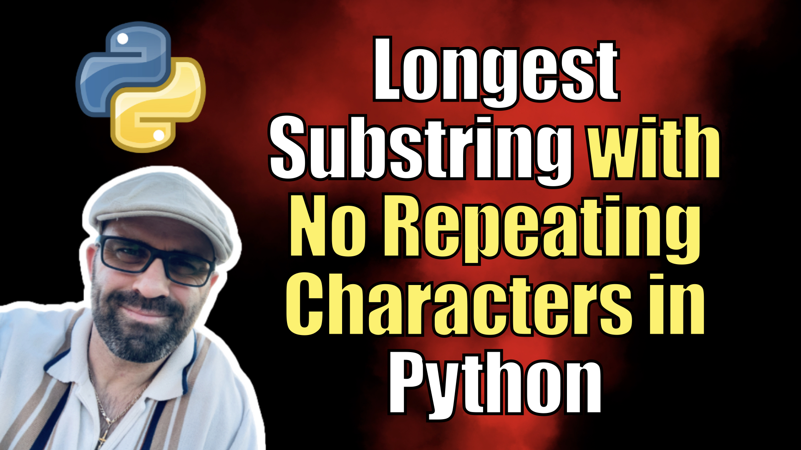

# Longest Substring with No Repeating Characters in Python

Given a string s, find the length of the longest substring without repeating characters.

This repository contains my code, my solution approach and explanation, as well as advice and tips for problem solving. I also have a video walkthrough of this challenge available on my [YouTube channel](https://youtu.be/fm03oRITfp8) and [my blog](https://kalbartal.net/longest-substring-with-no-repeating-characters-in-python/)

## Examples

Example 1:
Input: s = "abcabcbb"
Output: 3
Explanation: The answer is "abc", with the length of 3.

Example 2:
Input: s = "bbbbb"
Output: 1
Explanation: The answer is "b", with the length of 1.

Example 3:
Input: s = "pwwkew"
Output: 3
Explanation: The answer is "wke", with the length of 3.

## Note 

1. 0 ≤ s.length ≤ 5 * 10^4
2. s consists of English letters, digits, symbols, and spaces.

## Solution logic and code

We'll be using a sliding window approach; this consists of two pointers which will "slide" a window through the given string.

To get started, we'll set pointerA to the first character of the string, and pointerB to the second character of the string. Inside a for-loop, we'll then check to see if the two characters pointed by the pointers are the same (using conditionals) - if they're not, we can move pointerB one character over. If the two characters are the same, we reset both pointers to the beginning of the string, and move pointerB to the next character. 

To ensure our solution covers the edge case of the longest substring containing all the same characters, we can add an additional check at the end of the loop which checks the substring length. If the length of the substring is greater than the stored maximum length, we can update it to the new (longer) length.
 
The inner loop keeps sliding the pointers along until it reaches the end of the string, after which it'll return the maximum length of the substring.

## Time complexity

The time complexity of this code is O(n), where n is the length of the given string. This is because the only two operations we are performing are checking if two characters are the same and updating the maximum length of the substring, both of which take constant time, meaning they won't change depending on the size of the input. Therefore, the time complexity reduces to the number of characters in the string. 

## Space complexity

The space complexity of this code is also O(n), where n is the length of the given string, as we are only allocating memory for the two pointers and the maximum length. As a result, the amount of memory required is directly proportional to the size of the input. 

## Final thoughts

Tackling the problem of the longest substring with no repeating characters is certainly a challenging task, and making sure you have a robust solution is crucial! You'll need to think through the question carefully and come up with a plan of action that takes into account both the time and space complexities as well. 

At the same time, it can be a great opportunity to practice your string manipulation techniques, break down the problem into manageable steps, and work on your debugging skills. I have a video walkthrough of this problem on my [YouTube channel](https://youtu.be/fm03oRITfp8) if you'd like some help or further guidance. 

Good luck with this problem and happy coding!
